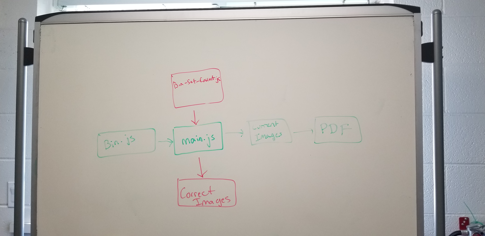

# Key Components Doc for Canvas Theme Status
#### *Author: Cal Wilson*
#### *Date: 4/24/2019*

# Preliminary Design

## Magic Box Chart

## Explanation of Design
1. bin.js
This is the normal-use method of running the program. In this method
bin.js calls main.js. Main.js runs Puppeteer and takes screenshots
of all the specified tasks and returns the information back to bin.js.
The screenshots are saved to ./screenshots. Then bin.js takes care of
creating the PDF. End method.

2. bin-set-correct.js
This method is used when the screenshots in the ./correct_screenshots
folder need to be updated. To achieve this, bin.js calls main.js, but
sends a filepath in as a parameter. Main.js runs Puppeteer and takes
screenshots of all the specified tasks. These screenshots are saved
to the ./correct_screenshots folder. End method.

### Used Libraries
 * Puppeteer
 * PDFkit
 * pMap
 * luxon
 * fs

-----

#### *Preliminary Design Approved By:* 
#### *Preliminary Design Approval Date:*

# Full Design

## Component Diagrams
<!-- Diagrams and companion explanations for all Key Components.
These would include information about inputs, outputs, and what a function does for every major function. -->

<!-- For each component, the following template will be followed: (In other words, the template below will repeat for each component)-->

### *Insert Component name here*

Diagram:

*Insert Diagram Here*

Explanation:

*Insert Explanation here*

## Test Plans

### *Insert Module Name Here*
#### How to Test:

-----

#### *Full Design Approved By:* 
#### *Full Design Approval Date:*

